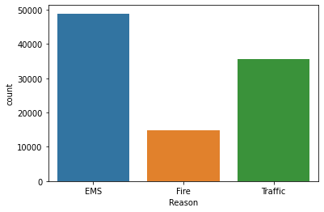
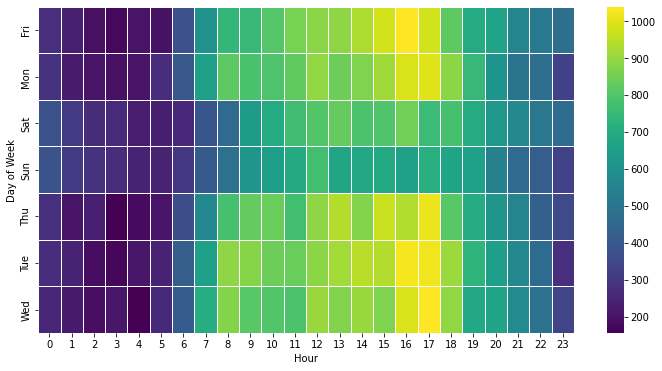
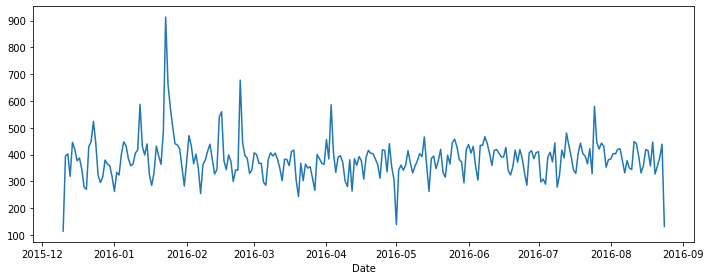

# 🚨 911 Calls Data Analysis - Project

An interactive data analysis project using real-world emergency call data from Montgomery County, Pennsylvania. This project dives deep into understanding emergency call patterns, types, locations, and time trends using Python and popular data visualization libraries.

---

## 📌 Project Overview

This capstone project focuses on:
- Extracting actionable insights from 911 emergency call data
- Understanding call volume patterns across time, location, and emergency type
- Visualizing trends using both static and interactive plots
- Preparing the dataset through feature engineering (like parsing datetime info)


## 📁 Dataset

The dataset used is `911.csv`, which includes:
- **lat/lon**: Geographic coordinates  
- **zip/township**: Location details  
- **title**: Contains the category of emergency (EMS, Fire, Traffic)  
- **timeStamp**: When the call was made  
- **desc**: Description of the incident  
- **twp**: Township  
- **e**: Dummy variable (always 1)  


## 🧠 Key Objectives

- 📍 Identify top ZIP codes and townships with most 911 calls  
- 📊 Analyze the most frequent types of emergencies  
- 📆 Explore how call volume varies by hour, day, and month  
- 🔍 Extract new features from timestamps (e.g., `Hour`, `Month`, `Day of Week`)  
- 🗺️ Use heatmaps and count plots to discover temporal-spatial trends  
- 📈 Build interactive visualizations using Plotly and Cufflinks  


## 🖼️ Visual Insights

### 📊 Count of 911 Calls by Reason
This visualization shows which type of emergency call is most common.




### 🔥 Heatmap of Calls by Hour and Day of Week
This heatmap reveals the busiest times of the week for emergency calls.




### 📈 911 Calls Over Time
A time series plot showing the trend in call volumes over several months.




## 🛠️ Tech Stack

- **Languages:** Python 
- **Libraries:**  
  - Data Analysis: `pandas`, `numpy`  
  - Visualization: `matplotlib`, `seaborn`, `plotly`, `cufflinks`, `missingno`  
  - Interactive Analysis: `IPython`, `Jupyter Notebook`  


## ✅ Future Enhancements
* Predictive modeling for emergency call types
* Deployment of a dashboard (e.g., Streamlit or Dash)
* Integration with real-time geo data APIs
* Anomaly detection on unusual call surges

## 🤝 Contributions
Feel free to open issues or pull requests to contribute or improve the analysis.


## 🚀 Getting Started

### Clone the Repo

```bash
git clone https://github.com/your-username/911-calls-analysis.git
cd 911-calls-analysis


